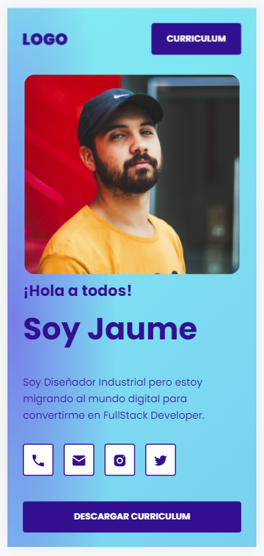

# El Portafolio de Jaume
> It is an exercise to practice HTML, CSS and Javascript. With this project you will be able to make your own online portfolio. In this case it is just an example with a non real person.
> Live demo [_here_](https://frankovg.github.io/El-portafolio-de-Jaume/).

## Table of Contents
* [General Info](#general-information)
* [Technologies Used](#technologies-used)
* [Features](#features)
* [Screenshots](#screenshots)
* [Acknowledgements](#acknowledgements)
* [Contact](#contact)

## General Information
- It is a good exercise for training HTML and CSS skills. The site is fully responsive and most of the buttons/links are functional.
- It also can be used as a real personal portfolio.

## Technologies Used
- Javascript
- HTML5
- CSS3
- Formspree

## Features
- Responsive.
- Email form is working (actually it sends the email to my personal account).

## Screenshots

## Acknowledgements
- This project was based on [Leonidas Esteban](https://leonidasesteban.com/) tutorial.

## Contact
Created by [Franco Amoroso](https://www.linkedin.com/in/francoamoroso/) - feel free to contact me!

